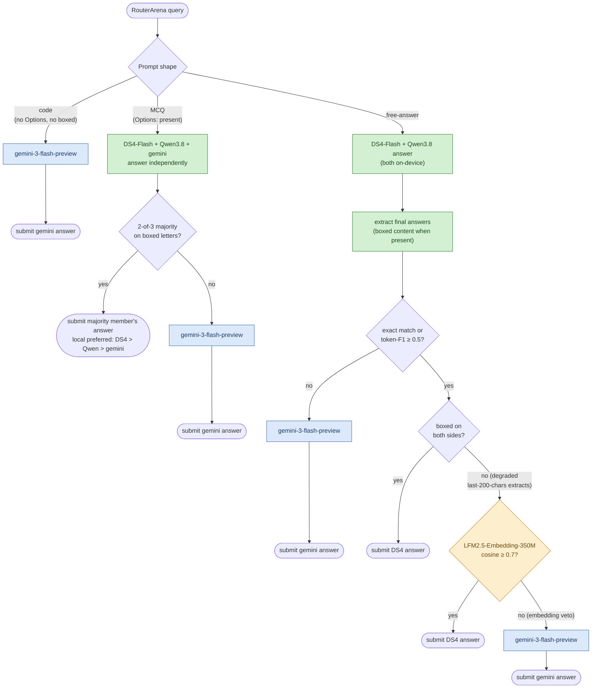

# lemonade-liquid-router — Design & Calibration Methodology

Supporting documentation for the **lemonade-liquid-router** RouterArena submission: what the routing policy is, where every design constant came from, and how each claim can be checked.

**Final verified scores** (RouterArena's own evaluation code, full 8,400-query split): accuracy **78.10%** · **$0.178/1K queries** · arena score (β=0.10) **76.75** · robustness **73.6** · 0 abnormal entries (`telemetry/scores.json`).

## 1. The submitted policy

Three voters — **DeepSeek-V4-Flash** (IQ2XXS quant, served locally by [Lemonade](https://github.com/lemonade-sdk/lemonade)'s `ds4` recipe), **Qwen3.8-27B** (UD-Q4_K_XL, Lemonade `llamacpp` recipe), and **gemini-3-flash-preview** (cloud) — plus an on-device referee: **LFM2.5-Embedding-350M** (F16 GGUF, Lemonade `llamacpp` recipe, embeddings endpoint). Each query is classified by prompt shape alone:

- **Code** (no `Options:` block, no boxed-answer instruction) → gemini-3-flash-preview directly.
- **MCQ** (`Options:` present) → all three voters answer independently; extracted boxed letters take a 2-of-3 majority vote; the submitted response comes from a majority member, local models preferred. No majority → gemini-3-flash-preview.
- **Free-answer** → both local models answer; if Qwen corroborates DeepSeek (exact match or token-F1 ≥ 0.5 on the extracted final answers), the local DeepSeek answer is submitted; otherwise gemini-3-flash-preview. When either side produced no boxed answer (the comparison ran on degraded last-200-chars extracts), keeping the local answer additionally requires the embedding referee: cosine ≥ 0.7 between the two extracts (**embedding veto**).

*Green = on-device via Lemonade (DS4-Flash, Qwen3.8; the token-F1 comparison is plain string arithmetic, no model involved). Amber = the on-device Liquid referee (embeddings endpoint). Blue = the cloud call. gemini also participates as the third MCQ voter; on the free-answer path it is contacted only after an escalation decision.*

The exact code that produced the submitted predictions is `policy/assemble_v52.py`; the same policy is implemented as a live router class in the submission PR. ~80% of the benchmark is answered entirely on-device. The local side is deterministic (temperature 0, thinking disabled, `max_tokens` 4096).

## 2. Compliance: what calibrated each design choice

RouterArena is evaluation-only — no component may be trained or tuned on its data or labels. Every constant in the policy traces to one of three sources: the external calibration set (§3), our own runtime/token telemetry, or aggregate statistics from the graded submissions the maintainers publish in their public repo. The third source was used only for model selection (which model fills a slot) — never to fit any per-query component, and never at per-row granularity. Full-set labels were touched only by pre-registered scoring runs of frozen configurations.

| Design choice | Source of the decision |
|---|---|
| DeepSeek-V4-Flash as primary local voter | External calibration set (§3): the local IQ2XXS quant scored **72.2% — exact parity with the API model** on identical items, 87% per-item agreement |
| Qwen3.8-27B as second voter | External calibration set: 66.2%, measured with the same harness |
| gemini-3-flash-preview as cloud voter and code specialist | Public graded submissions already in the RouterArena repo — the same data visible to every submitter — showed its code-slice strength (92.1%) at a fraction of larger models' token bill |
| 2-of-3 majority vote; local-preferred response selection | Voter-agreement statistics measured **label-free** on our own generations: unanimous 77.3%, majority 17.2%, no majority 5.5% |
| token-F1 ≥ 0.5 free-answer corroboration threshold | External calibration set (TUNE/HOLDOUT split) |
| Embedding veto (LFM2.5-Embedding-350M, cosine ≥ 0.7) on degraded free-answer comparisons | Label-free ablation on our own generations, judged against a gemini-agreement pseudo-reference: the veto raises keep-precision 0.877 → 0.904 on the 633 measurable fallback pairs; threshold chosen at the precision knee. No RouterArena labels involved. Raw-encoder cosine and a 350M generative LLM-judge were evaluated the same way and rejected (no signal) |
| Escalations to gemini-3-flash-preview rather than a larger model | Adverse-selection measurement on calibration: every cloud model scores far below its solo average on rows selected as hard by the local models, so a pricier escalation target buys verbosity, not accuracy |
| `deepseek/deepseek-v4-pro` declared in config | Pre-registered fallback for escalations; unused in the final predictions (all escalations resolved to gemini-3-flash-preview) |

## 3. The external calibration set

A **1,251-item set sampled from the upstream public benchmarks** that RouterArena's categories draw from, using RouterArena's own prompt templates, covering 86.8% of its source mass (`calibration/coverage_report.json`), and **deduplicated against every RouterArena split** (sub_10, full, robustness).

- `calibration/build_calibration.py` — the exact builder (fetches from the upstream benchmark sources directly).
- `calibration/calibration_manifest.jsonl` — one row per item with the source name and SHA-256 hashes of the raw question and the formatted prompt. **This makes the dedup claim independently checkable**: hash any RouterArena split and intersect with the manifest — the intersection is empty. Item content is not republished here to avoid redistributing the upstream benchmarks.
- `tools/run_calibration_anchor.py` — the resumable harness used for every calibration measurement cited above.

## 4. Verifying our numbers

The submission was scored with RouterArena's unmodified evaluation code (`check_config_prediction_files.py`, `llm_evaluation/run.py`) on the frozen prediction files in the PR; `telemetry/scores.json` records the result. The replication recipe — models, recipes, environment variables, and the standard RouterArena pipeline commands — is in the submission PR body.

One reproducibility note for the local side: Qwen3.8-27B on ROCm nightly builds can corrupt under concurrent requests (filed as [lemonade#3160](https://github.com/lemonade-sdk/lemonade/issues/3160)); our generations were produced with sequential requests and a known-answer canary between batches.

Raw generation logs (all local and cloud passes, full responses) contain RouterArena prompt content and are therefore not republished; they are available to RouterArena maintainers on request: ramkrishna2910@gmail.com.
